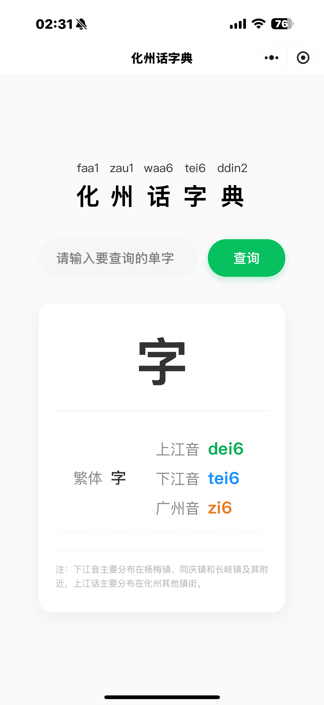
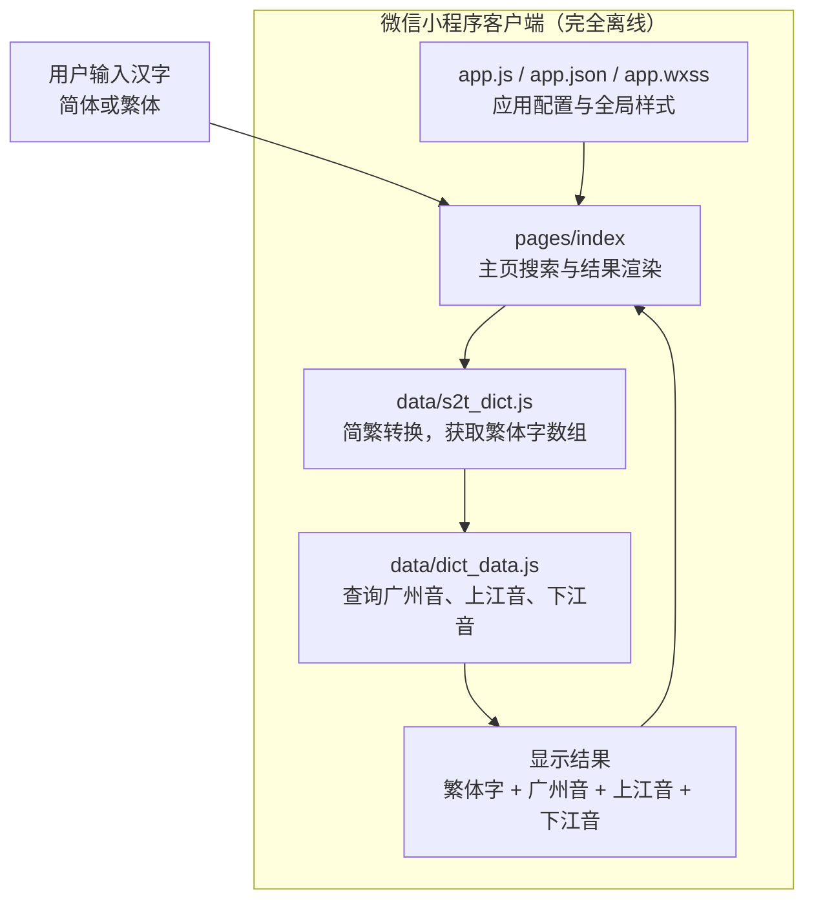

# 化州话字典

微信小程序，查询化州方言（粤语分支）的汉字读音。
这是全国第一个查询化州话拼音字典产品。

[English Version →](README_EN.md)

---

## 使用

微信小程序搜索 **"化州话字典"** 即可使用。



## 功能

- 支持**简体字**和**繁体字**输入
- 自动**简繁转换**，处理一字多繁体
- 同时给出**广州音**、**上江音**和**下江音**三种读音
- 完全离线，无需网络

## 关于读音

提供三种读音：

| 音系 | 说明 | 显示颜色 |
|------|------|----------|
| **广州音** | 标准粤语（香港语言学学会粤拼方案） | 🟧 橙色 |
| **上江音** | 化州大部分镇街 | 🟩 绿色 |
| **下江音** | 杨梅镇、同庆镇、长岐镇及其附近 | 🟦 蓝色 |

## Architecture



## 项目结构

```
├── data/
│   ├── dict_data.js       # 方言字典（4310字条，含广州音/上江/下江）
│   └── s2t_dict.js        # 简繁转换字典（~4000条映射）
├── pages/
│   └── index/             # 主页 — 字典搜索
├── app.js / app.json / app.wxss
├── project.config.json
└── sitemap.json
```

## 技术栈

- 微信小程序原生框架 (glass-easel)
- 基础库 3.15.0+
- 纯客户端，无云开发依赖
- 拼音方案基于香港语言学学会粤语拼音方案（Jyutping）

## 相关链接

- 代码仓库：[github.com/ZedingZhang/huazhou-dictionary-miniprogram](https://github.com/ZedingZhang/huazhou-dictionary-miniprogram)

---

[English Version →](README_EN.md)
