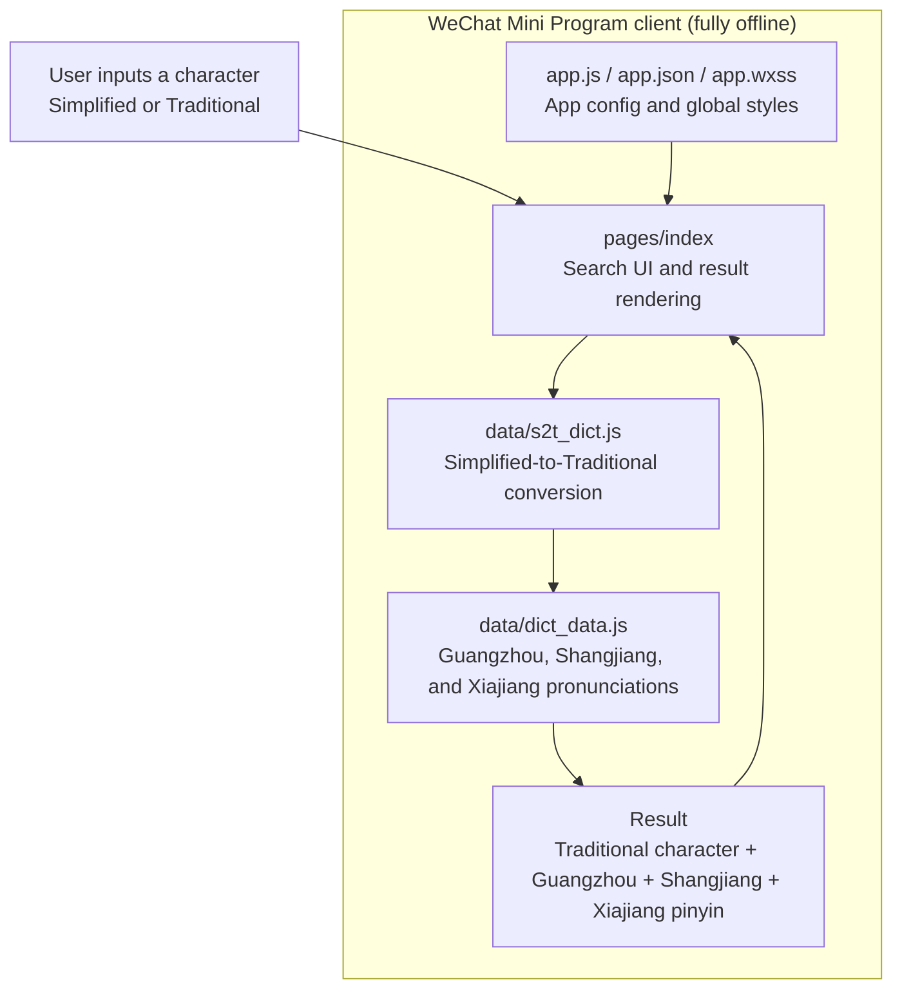

# Huazhou Dialect Dictionary

A WeChat Mini Program for looking up character pronunciations in the Huazhou dialect (a branch of Cantonese / Yue Chinese).
This is the first dictionary product in China dedicated to Huazhou dialect pronunciation lookup.

[← 中文版](README.md)

---

## How to Use

Search **"化州话字典"** on WeChat Mini Program.


## Features

- Supports both **Simplified** and **Traditional** Chinese characters
- Automatic **Simplified-to-Traditional** conversion, handling one-to-many mappings
- Displays **Guangzhou** (Cantonese), **Shangjiang** (上江), and **Xiajiang** (下江) pronunciations
- Fully offline — no network required

## About the Pronunciations

Three pronunciation systems are provided:

| System | Description | Display Color |
|--------|-------------|---------------|
| **Guangzhou** (广州音) | Standard Cantonese (LSHK Jyutping) | <span style="color:#e67e22">■ Orange</span> |
| **Shangjiang** (上江音) | Most towns and streets in Huazhou | <span style="color:#06ad56">■ Green</span> |
| **Xiajiang** (下江音) | Yangmei, Tongqing, Changqi towns | <span style="color:#1890ff">■ Blue</span> |

## Architecture



## Project Structure

```
├── data/
│   ├── dict_data.js       # Dialect dictionary (4,310 entries)
│   └── s2t_dict.js        # Simplified-to-Traditional map (~4,000 mappings)
├── pages/
│   └── index/             # Main page — dictionary search
├── app.js / app.json / app.wxss
├── project.config.json
└── sitemap.json
```

## Tech Stack

- WeChat Mini Program native framework (glass-easel)
- Base library 3.15.0+
- Fully client-side, no cloud dependencies
- The pronunciation system is based on the LSHK Jyutping scheme

## Links

- Repository: [github.com/nebula167/huazhou-dictionary-miniprogram](https://github.com/nebula167/huazhou-dictionary-miniprogram)

---

[← 中文版](README.md)
